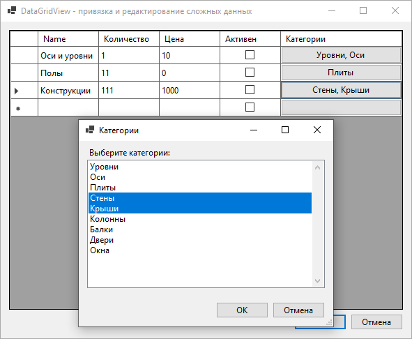

# DataGridView Test App

“естовое приложение, демонстрирующее редактирование сложной структуры данных
вида "—писок + ¬ложенные списки":

`Dictionary<string, List<Object>>`

»спользуетс€ DataGridView + C# WIndows Forms.

ѕримененные технологии: прив€зка данных, динамически генерируемые кнопки дл€ редактирование вложенных данных.

License: MIT

Zuev Aleksandr, 2024.